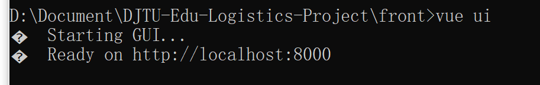
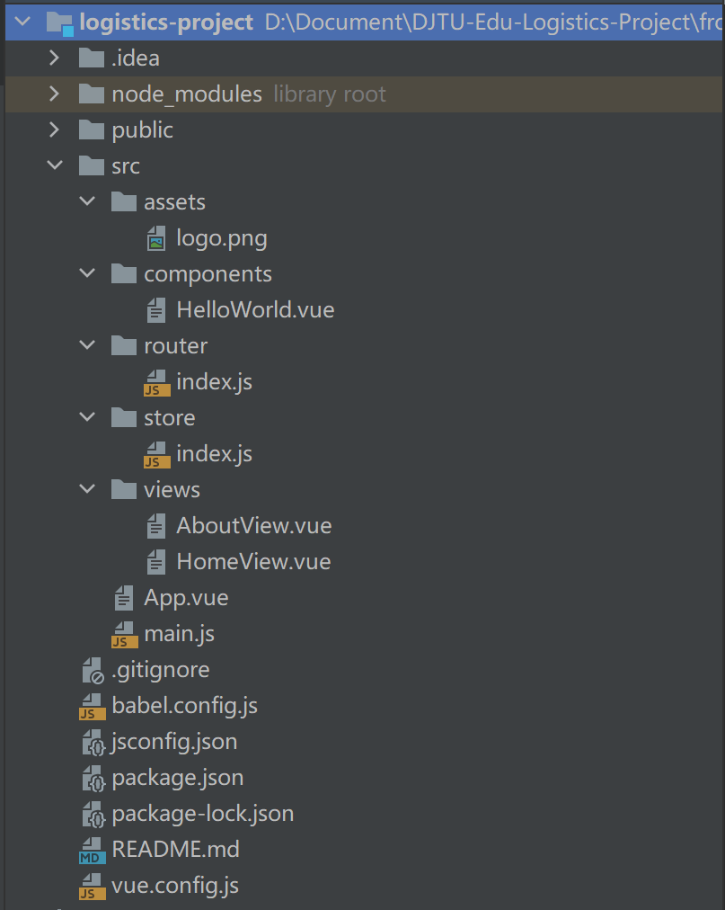

# DJTU 后勤管理系统

> 大连交通大学 信息学院 张箬晗、刘嘉宁
>
> 一个简易的后勤管理系统，学习、练习的项目笔记


## 项目技术栈

- 前端
    - Vue
    - Vue-router
    - Element-ui
    - Vuex
    - axios
- 后端
    - SpringMVC
    - Mybatis
    - Shiro
    - 数据库：MySQL、Redis
    - 版本管理：git
    - 项目管理：Maven


## Vue 环境的配置

- 安装 Vue-cli 环境

    - 链接：[Vue 官网的 Vue Cli 安装教程](https://cli.vuejs.org/zh/guide/installation.html)

    1. 先安装 node.js 环境，在安装时会自动配置 node 和 npm 全局变量
        - 链接：[node.js 官网](https://nodejs.org/en/)

    

    2. 使用 `node -v` `npm -v` 命令查看是否安装成功
    
    
    
    3. 在文件夹下打开 cmd 命令行执行 `vue ui` 命令开始创建 vue 项目




## Vue 项目环境介绍

- 使用 idea 打开刚刚创建的 vue 项目

    1. node_modules：npm 加载的项目依赖模块， 存放项目的所有依赖

    2. public：一些公共的内容

    3. src：项目的源码，存放开发者写的代码
        1. assets：存放图片
        2. components：存放组件文件（一些可复用，非独立的页面）
        3. router： 存放了路由的 js 文件，index.js
        4. store：实现全局存储
        5. views：存放界面

        - App.vue：项目入口文件，是一个 Vue 组件，也是项目的第一个 Vue 组件
        - main.js：核心文件，相当于 Java中的 main 方法，是整个项目的入口 js

    - .xxxx：配置文件，包括git配置和语法配置等
    - package.json：项目配置文件，定义了项目的所有依赖，包括开发时依赖和发布时依赖
    - README.md：说明文档



- 在 idea 中添加 npm 的运行配置并设置 Script 为 serve 即可让 idea 一键启动 vue 项目


## element-ui 环境安装

- 在 vue 项目下 执行命令 `npm i element-ui -S` 


- 安装成功后在 package.json 中可以看到相应记录


- 在 main.js 中导入 elememt-ui

```js
import ElementUI from 'element-ui';
import 'element-ui/lib/theme-chalk/index.css';

Vue.use(ElementUI);
```


## axios 环境安装

- 在 vue 项目下 执行命令 `npm install axios -S`


- 安装成功后在 package.json 中可以看到相应记录


- 在 main.js 中导入 axios

```js
import axios from 'axios';

Vue.prototype.$axios = axios
```


## 后端 Vue 跨域问题解决

- 在 spring 的配置文件中添加

```xml
    <!-- 允许所有请求通过, 解决 vue 跨域问题   -->
    <mvc:cors>
        <mvc:mapping path="/**"
                     allowed-origin-patterns="*"
                     allowed-methods="POST,GET,OPTIONS,DELETE,PUT,PATCH"
                     allowed-headers="Content-Type,Access-Control-Allow-Headers,Authorization,X-Requested-With"
                     allow-credentials="true"/>
    </mvc:cors>
```

> 也可以使用精简写法
>
> ```xml
>     <mvc:cors>
>         <mvc:mapping path="/**" />
>     </mvc:cors>
> ```


## 后端 Shiro 配置

- 在 config 包下创建配置类 

```java
@Configuration
public class ShiroConfig {

    //1.创建 ShiroFilter 负责拦截所有请求
        //将 name 设为与 web.xml 中 filter-name 一致, 让过滤器自动找到这个 bean
    @Bean(name = "shiroFilter")
    public ShiroFilterFactoryBean getShiroFilterFactoryBean(DefaultWebSecurityManager defaultWebSecurityManager){

        //创建过滤工厂实例, 设置默认安全管理器
        ShiroFilterFactoryBean shiroFilterFactoryBean = new ShiroFilterFactoryBean();
        shiroFilterFactoryBean.setSecurityManager(defaultWebSecurityManager);

        Map<String, String> map = new HashMap<>();
        //配置系统的受限资源: 所有请求
        map.put("/test2.do", "authc"); // authc 代表资源需要认证和授权
        //配置系统的公共资源
        map.put("/test1.do", "anon");
        shiroFilterFactoryBean.setFilterChainDefinitionMap(map);
            //设置被拦截时跳转的地址
        shiroFilterFactoryBean.setLoginUrl("/login.do");

        return shiroFilterFactoryBean;
    }

    //2.创建安全管理器
    @Bean
    public DefaultWebSecurityManager getDefaultWebSecurityManager(Realm realm){
        DefaultWebSecurityManager defaultWebSecurityManager = new DefaultWebSecurityManager();
        defaultWebSecurityManager.setRealm(realm);
        return defaultWebSecurityManager;
    }

    //3.创建自定义 Realm
    @Bean
    public Realm getRealm(){
        return new CustomerRealm();
    }

}
```

- 在 shiro.realms 包下创建 Realm 实现类

```java
public class CustomerRealm extends AuthorizingRealm {
    
    //验证是否使用的是自定义 token
    @Override
    public boolean supports(AuthenticationToken token) {
        return token instanceof JwtToken;
    }
    
    //授权
    @Override
    protected AuthorizationInfo doGetAuthorizationInfo(PrincipalCollection principal) {
        return null;
    }

    //认证
    @Override
    protected AuthenticationInfo doGetAuthenticationInfo(AuthenticationToken token) 
        throws AuthenticationException {
        
        return null;
    }
}
```

- 在 web.xml 中配置启用 Shiro 过滤器

```xml
    <!-- shiro过虑器，DelegatingFilterProxy通过代理模式 关联spring容器中的bean和filter -->
    <filter>
        <filter-name>shiroFilter</filter-name>
        <filter-class>org.springframework.web.filter.DelegatingFilterProxy</filter-class>
        <!-- 设置true由servlet容器控制filter的生命周期 -->
        <init-param>
            <param-name>targetFilterLifecycle</param-name>
            <param-value>true</param-value>
        </init-param>
        <!-- 设置spring容器filter的bean id，如果不设置则找与filter-name一致的bean-->
        <!--    <init-param>-->
        <!--      <param-name>targetBeanName</param-name>-->
        <!--      <param-value>shiroFilter</param-value>-->
        <!--    </init-param>-->
    </filter>
    <filter-mapping>
        <filter-name>shiroFilter</filter-name>
        <url-pattern>/*</url-pattern>
    </filter-mapping>
```


### Shiro 认证配置

1. 接收 token
2. 解析 token
3. 验证用户名密码：详见 <a href="#后端 md5 配置">后端 md5 配置</a> 

```java
    @Override
    protected AuthenticationInfo doGetAuthenticationInfo(AuthenticationToken token)
            throws AuthenticationException {

        //向下转型 token 为自定义 token 类型
        JwtToken jwtToken = (JwtToken) token;
        //获取 token 实例中的 token 信息
        String jwt = (String) jwtToken.getPrincipal();
        //使用工具类解析 token
        Claims claims = JwtUtil.parseJWT(jwt);
        //获取解析后的用户名
        String username = claims.getId();

        User user = userService.getUserByUsername(username);
        if (user == null){
            return null;
        }
        return new SimpleAuthenticationInfo(
                username, //用户名
                user.getPassword(), //密码
                ByteSource.Util.bytes(user.getSalt()), //盐
                this.getName());
    }
```


### Shiro 授权配置

- 在 com.djtu.config 下的 ShiroConfig 配置类中添加注解驱动

```java
    // 开启 @RequiresRoles、@RequiresPermissions 注解代理
    @Bean
    public DefaultAdvisorAutoProxyCreator defaultAdvisorAutoProxyCreator() {
        DefaultAdvisorAutoProxyCreator app = new DefaultAdvisorAutoProxyCreator();
        app.setProxyTargetClass(true);
        return app;
    }
    @Bean
    public AuthorizationAttributeSourceAdvisor authorizationAttributeSourceAdvisor(SecurityManager securityManager) {
        AuthorizationAttributeSourceAdvisor authorizationAttributeSourceAdvisor = new AuthorizationAttributeSourceAdvisor();
        authorizationAttributeSourceAdvisor.setSecurityManager(securityManager);
        return authorizationAttributeSourceAdvisor;
    }
```

1. 获取当前用户角色信息
2. 获取当前用户权限信息
3. 设置授权信息

```java
    //授权
    @Override
    protected AuthorizationInfo doGetAuthorizationInfo(PrincipalCollection principal) {
        
        //这里只有在登录之后才会执行
        
        String username = (String) principal.iterator().next();
        Set<String> roles = roleService.getRoleByUsername(username);
        Set<String> permissions = permissionService.getPermissionByUsername(username);

        SimpleAuthorizationInfo info = new SimpleAuthorizationInfo();
        info.addRoles(roles);
        info.addStringPermissions(permissions);
        return info;
    }
```


## 后端 JWT 配置

- 在 com.djtu.utils 下创建 JwtUtil 类，用于 jwt 加密、解密、验证 jwt 是否过期

```java
public class JwtUtil {

    //加密
    public static String createJWT(String username, String issuer, String subject, long ttlMillis) {

        //The JWT signature algorithm we will be using to sign the token
        SignatureAlgorithm signatureAlgorithm = SignatureAlgorithm.HS256;

        long nowMillis = System.currentTimeMillis();
        Date now = new Date(nowMillis);

        //We will sign our JWT with our ApiKey secret
        byte[] apiKeySecretBytes = DatatypeConverter.parseBase64Binary("1sf12sds21ie1inecs078j");
        Key signingKey = new SecretKeySpec(apiKeySecretBytes, signatureAlgorithm.getJcaName());

        //Let's set the JWT Claims
        JwtBuilder builder = Jwts.builder().setId(username)
                .setIssuedAt(now)
                .setSubject(subject)
                .setIssuer(issuer)
                .signWith(signatureAlgorithm, signingKey);

        //if it has been specified, let's add the expiration
        if (ttlMillis >= 0) {
            long expMillis = nowMillis + ttlMillis;
            Date exp = new Date(expMillis);
            builder.setExpiration(exp);
        }

        //Builds the JWT and serializes it to a compact, URL-safe string
        return builder.compact();
    }

    //解密
    public static Claims parseJWT(String jwt) {
        //This line will throw an exception if
        // it is not a signed JWS (as expected)
        try {


            Claims claims = Jwts.parser()
                    .setSigningKey(DatatypeConverter.parseBase64Binary("1sf12sds21ie1inecs078j"))
                    .parseClaimsJws(jwt)
                    .getBody();
            return claims;
        }catch (ExpiredJwtException e){
            return null;
        }
//        System.out.println("ID: " + claims.getId());
//        System.out.println("Subject: " + claims.getSubject());
//        System.out.println("Issuer: " + claims.getIssuer());
//        System.out.println("Expiration: " + claims.getExpiration());

    }

    // 判断是否过期
    public static boolean isTokenExpired(Date expiration) {
        return expiration.before(new Date());
    }

}
```

- 在 com.djtu.token 下创建 JwtToken 类，里面包装了加密后的 token 字符串、密码、等

```java
package com.djtu.token;

import com.djtu.utils.JwtUtil;
import lombok.Data;
import org.apache.shiro.authc.HostAuthenticationToken;
import org.apache.shiro.authc.RememberMeAuthenticationToken;
import org.springframework.stereotype.Component;

import java.util.Arrays;

/**
 * 自定义 token 类, 使用 jwt 传来的 token 进行身份验证
 * 具体实现仿照了 UsernamePasswordToken 类
 */
@Data
@Component
public class JwtToken implements HostAuthenticationToken, RememberMeAuthenticationToken {

    private String token;
    private char[] password;
    private boolean rememberMe;
    private String host;

    @Override
    public Object getPrincipal() {
        return token;
    }

    @Override
    public Object getCredentials() {
        return password;
    }

    public JwtToken() {
        this.rememberMe = false;
    }

    public JwtToken(String token) {
        this.token = token;
    }

    public JwtToken(String token, char[] password) {
        this(token, (char[])password, false, (String)null);
    }

    public JwtToken(String token, String password) {
        this(token, (char[])(password != null ? password.toCharArray() : null), false, (String)null);
    }

    public JwtToken(String token, char[] password, String host) {
        this(token, password, false, host);
    }

    public JwtToken(String token, String password, String host) {
        this(token, password != null ? password.toCharArray() : null, false, host);
    }

    public JwtToken(String token, char[] password, boolean rememberMe) {
        this(token, (char[])password, rememberMe, (String)null);
    }

    public JwtToken(String token, String password, boolean rememberMe) {
        this(token, (char[])(password != null ? password.toCharArray() : null), rememberMe, (String)null);
    }

    public JwtToken(String token, char[] password, boolean rememberMe, String host) {
        this.rememberMe = false;
        this.token = token;
        this.password = password;
        this.rememberMe = rememberMe;
        this.host = host;
    }

    public JwtToken(String username, String password, boolean rememberMe, String host) {
        this(username, password != null ? password.toCharArray() : null, rememberMe, host);
    }

//    @Override
//    public String toString() {
//        StringBuilder sb = new StringBuilder();
//        sb.append(this.getClass().getName());
//        sb.append(" - ");
//        sb.append(JwtUtil.parseJWT(this.token).getId());
//        sb.append(", rememberMe=").append(this.rememberMe);
//        if (this.host != null) {
//            sb.append(" (").append(this.host).append(")");
//        }
//        return sb.toString();
//    }


    @Override
    public String toString() {
        return "JwtToken{" +
                "token='" + token.substring(0, 5) + '\'' +
                ", password=" + Arrays.toString(password) +
                ", rememberMe=" + rememberMe +
                ", host='" + host + '\'' +
                '}';
    }
}
```

- 在 com.djtu.response 下创建 Result 类，封装了返回值类型

```java
@Data
@AllArgsConstructor
@NoArgsConstructor
@Accessors(chain = true) //可以链式操作
public class Result<T>{
    private int code;

    private String message;

    private T data;
}
```

- 在 com.djtu.shiro.filter 下创建 JwtFilter 类

```java
public class JwtFilter extends AuthenticatingFilter {

    /**
     * 创建 token 的方法
     * @param servletRequest req
     * @param servletResponse resp
     * @return 创建好的 token
     * @throws Exception
     */
    @Override
    protected AuthenticationToken createToken(ServletRequest servletRequest, ServletResponse servletResponse)
            throws Exception {

        HttpServletRequest request = (HttpServletRequest) servletRequest;
        //由前端在请求头中 Authorization 添加的 jwt
        String jwt = request.getHeader("Authorization");
        if(StringUtils.isEmpty(jwt)) {
            return null;
        }
        return new JwtToken(jwt);
    }

    /**
     * 拦截的主要方法
     * @param servletRequest req
     * @param servletResponse resp
     * @return 是否通过拦截
     * @throws Exception
     */
    @Override
    protected boolean onAccessDenied(ServletRequest servletRequest, ServletResponse servletResponse)
            throws Exception {

        HttpServletRequest request = (HttpServletRequest) servletRequest;
        //如果没有这个头, 就是第一次请求, 所以就通过
        String jwt = request.getHeader("Authorization");
        if(StringUtils.isEmpty(jwt)) {
            return true;
        } else {
            // 校验jwt
            Claims claim = JwtUtil.parseJWT(jwt);
            if(claim == null || JwtUtil.isTokenExpired(claim.getExpiration())) {
                HttpServletResponse response = (HttpServletResponse)servletResponse;
                response.setContentType("application/plain;charset=utf-8");
                PrintWriter writer = response.getWriter();
                writer.write(new ObjectMapper().writeValueAsString(new Result().setCode(401).setMessage("身份已过期，请重新登录")));
                return false;
//                throw new ExpiredCredentialsException("token已失效，请重新登录");
            }

            // 执行登录
            return executeLogin(servletRequest, servletResponse);
        }
    }

    /**
     * 登录失败时进行的操作
     * @param token token
     * @param e exception
     * @param request req
     * @param response resp
     * @return bool
     */
    @Override
    protected boolean onLoginFailure(AuthenticationToken token, AuthenticationException e, ServletRequest request, ServletResponse response) {

        HttpServletResponse httpServletResponse = (HttpServletResponse) response;

        Throwable throwable = e.getCause() == null ? e : e.getCause();

        Result result = new Result().setMessage(e.getMessage());
        String json = null;
        try {
            json = new ObjectMapper().writeValueAsString(result);
        } catch (JsonProcessingException ex) {
            throw new RuntimeException(ex);
        }

        try {
            httpServletResponse.getWriter().print(json);
        } catch (IOException ioException) {

        }
        return false;
    }

}
```

- 在 com.djtu.config 下的 ShiroConfig 配置类中添加 JwtFilter 过滤器，并配置过滤器的拦截路径，

```java
package com.djtu.config;

@Configuration
public class ShiroConfig {

    //1.创建 ShiroFilter 负责拦截所有请求
        //将 name 设为与 web.xml 中 filter-name 一致, 让过滤器自动找到这个 bean
    @Bean(name = "shiroFilter")
    public ShiroFilterFactoryBean getShiroFilterFactoryBean(DefaultWebSecurityManager defaultWebSecurityManager, JwtFilter jwtFilter){

        //创建过滤工厂实例, 设置默认安全管理器
        ShiroFilterFactoryBean shiroFilterFactoryBean = new ShiroFilterFactoryBean();
        shiroFilterFactoryBean.setSecurityManager(defaultWebSecurityManager);

        Map<String, Filter> filterMap = new HashMap<>();
        filterMap.put("jwt", jwtFilter);

        Map<String, String> map = new HashMap<>();
        /*
        //配置系统的受限资源
        map.put("/test2.do", "authc");
        //配置系统的公共资源
        map.put("/test1.do", "anon");
         */

        //让所有的请求进 jwt 拦截器
        map.put("/", "jwt");

        //添加过滤器
        shiroFilterFactoryBean.setFilters(filterMap);
        //添加过滤map
        shiroFilterFactoryBean.setFilterChainDefinitionMap(map);
            //设置被拦截时跳转的地址
        shiroFilterFactoryBean.setLoginUrl("/login.do");

        return shiroFilterFactoryBean;
    }

    //2.创建安全管理器
    //......

    //3.创建自定义 Realm
    //......

    @Bean
    public JwtFilter getJwtFilter(){
        return new JwtFilter();
    }

}
```

<a name="后端 md5 配置"> </a> 

## 后端 md5 配置

- 在 com.djtu.shiro.matchers 下创建 MyHashedCredentialsMatcher 类

```java
public class MyHashedCredentialsMatcher extends HashedCredentialsMatcher {

    @Override
    public boolean doCredentialsMatch(AuthenticationToken token, AuthenticationInfo info) {

        //如果没有 token , 那就是第一次访问或者访问的是登陆页面, 直接放行
        if (((JwtToken) token).getPassword() == null){
            return true;
        }

        //如果有 token 那就是有身份, 进行验证 md5 的密码...
        return super.doCredentialsMatch(token, info);
    }

}
```

- 在 com.djtu.config 下的 ShiroConfig 配置类中为 Realm 设置自定义的密码验证器，并指定加密方式散列次数

```java
@Configuration
public class ShiroConfig {

    //1.创建 ShiroFilter 负责拦截所有请求
        //将 name 设为与 web.xml 中 filter-name 一致, 让过滤器自动找到这个 bean
    //......

    //2.创建安全管理器
    @Bean
    public DefaultWebSecurityManager getDefaultWebSecurityManager(Realm realm){
        //向下转型 realm 这样才可以设置密码验证器
        CustomerRealm customerRealm = (CustomerRealm) realm;
        //设置密码验证器
        //1. 创建 Shiro 提供的 CredentialsMatcher 密码验证器
        MyHashedCredentialsMatcher matcher = new MyHashedCredentialsMatcher();
        //2. 设置其加密方式
        matcher.setHashAlgorithmName("md5");
        //3. 设置散列次数
        matcher.setHashIterations(1024);
        //4. 为自定义的 Realm 设置 CredentialsMatcher
        customerRealm.setCredentialsMatcher(matcher);

        DefaultWebSecurityManager defaultWebSecurityManager = new DefaultWebSecurityManager();
        defaultWebSecurityManager.setRealm(customerRealm);
        return defaultWebSecurityManager;
    }

    //3.创建自定义 Realm
    @Bean
    public Realm getRealm(){
        return new CustomerRealm();
    }

    @Bean
    public JwtFilter getJwtFilter(){
        return new JwtFilter();
    }

}
```


## 前端 Vue 中的 JWT 存储

- 在 src/store 下的 index.js 文件书写内容，在 state、 localStorage 中存储 token、userInfo 实现全局储存

```js
import Vue from 'vue'
import Vuex from 'vuex'

Vue.use(Vuex)

export default new Vuex.Store({
  state: {
    token:localStorage.getItem("token"), //将state中的token设为localStorage中的token值
    userInfo:JSON.parse(localStorage.getItem("userInfo")) //将state中的userInfo设为localStorage中的userInfo值
  },
  getters: {
    getUser: state => { //获取 state 中的 userInfo
      return state.userInfo;
    },
    getToken: state => { //获取 state 中的 token
      if (state.token == null) { //是第一次登录
        return '';
      }
      return state.token;
    }
  },
  mutations: {
    SET_TOKEN:(state, token)=>{ //设置 state 中的 token
      state.token = token;
      localStorage.setItem("token", token);
    },
    SET_USERINFO:(state, userInfo)=>{ //设置 state 中的 userInfo
      state.userInfo = userInfo;
      localStorage.setItem("userInfo", userInfo);
    },
    REMOVE_INFO:(state)=>{ //删除 state 和 localStorage 中的 token 和 userInfo
      state.token = '';
      state.userInfo = {};
      localStorage.setItem("token", '');
      localStorage.setItem("userInfo", JSON.stringify(''));
    }
  },
  actions: {
  },
  modules: {
  }

})
```


## 前端 Vue 创建新页面流程

1. 在 src/views 下创建 vue 页面文件, 并设置 name

```vue
<template>
	<!--拷贝 饿了么 中的 组件代码-->
</template>

<script>
export default {
  name: "login",
    <!--拷贝 饿了么 中的 data 和 methods-->
}
</script>

<style scoped>
	/*拷贝饿了么中的内容*/
</style>
```

2. 在 src/router 下的 index.js 中填写路由信息

```js
import Vue from 'vue'
import VueRouter from 'vue-router'

import test from "@/views/test";
import login from "@/views/login"; //导入 /views/ 下的对应文件

Vue.use(VueRouter)

const routes = [
  {
    path:"/",
    name:"test",
    component:test
  },
  { //添加一个新的路由地址
    path:"/login", //设置访问地址
    name:"login",
    component: login //在这里设置 import 导入的对应文件
  }
]
```

- 设置路由等等...略


## 前端 Vue data 的 rules

- 什么是 rules ?
- 是对 data 数据的验证，name 与表单中 prop 的值对应？
    - **type**：类型
    - **required**：是否必选项（此栏是否为空）
    - **message**：报错信息
    - **trigger**：触发方式
        - **blur** ：失去焦点时进行验证（对 `input` 输入框的验证）
        - **change** ：当值发生变化时进行验证（下拉框`select`，日期选择框`date-picker`，复选框`checkbox`，单选框`radio`）

    - **min / max**：最小 / 最大 长度


```javascript
name:[
    {type: 'string', required: true, message: "名称必填", trigger: 'blur'},
	{min: 3, max: 30, message: "名称长度不能超过30位"}
]
```

- 在 form 标签中指定 :rules


- 在 data 中添加 rules


## 前端 Vue 的请求拦截配置

- 配置基础链接 在 src 下创建 axios.js 

```js
import axios from "axios";

//配置 axios 每个链接的公共字符
axios.defaults.baseURL = "http://localhost:8080/logisticsProject";
```

- 在 main.js 中导入刚刚创建好的文件

```js
import "./axios"
```

- 在 src / axios.js  配置前置拦截和后置拦截，功能增强【没有过滤功能】

```js
//前置拦截
axios.interceptors.request.use(config => {
    return config; //不进行前置拦截
})

//后置拦截: 根据后端给前端的状态码进行拦截, 这样在其他页面就只需要处理 200 状态码的情况了
axios.interceptors.response.use(resp =>{
    let res = resp.data;
    if (res.code == 200){ // 200 成功 不拦截
        return resp;
    }else if(res.code == 401){ // 401 失败 显示失败信息, 跳转至 登录页面
        ElementUI.Message.error(res.message, {duration:3*1000});
        router.push("/login");
        return Promise.reject(res.message);
    }else { // 失败 显示失败信息
        ElementUI.Message.error(res.message, {duration:3*1000});
        return Promise.reject(res.message);
    }
})
```


