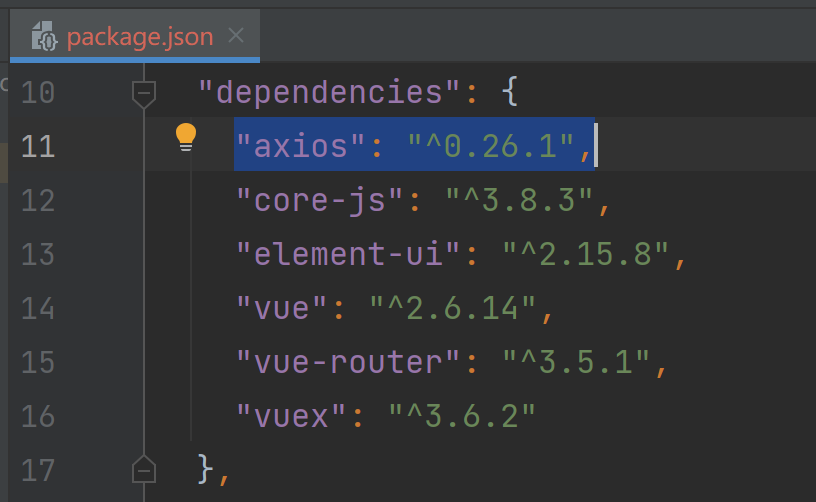

# DJTU 后勤管理系统

> 大连交通大学 信息学院 张箬晗、刘嘉宁
>
> 一个简易的后勤管理系统，学习、练习的项目笔记


## 项目技术栈

- 前端
    - Vue
    - Vue-router
    - Element-ui
    - Vuex
    - axios
- 后端
    - SpringMVC
    - Mybatis
    - Shiro
    - 数据库：MySQL、Redis
    - 版本管理：git
    - 项目管理：Maven


## Vue 环境的配置

- 安装 Vue-cli 环境

    - 链接：[Vue 官网的 Vue Cli 安装教程](https://cli.vuejs.org/zh/guide/installation.html)

    1. 先安装 node.js 环境，在安装时会自动配置 node 和 npm 全局变量
        - 链接：[node.js 官网](https://nodejs.org/en/)

    

    2. 使用 `node -v` `npm -v` 命令查看是否安装成功
    
    
    
    3. 在文件夹下打开 cmd 命令行执行 `vue ui` 命令开始创建 vue 项目


## Vue 项目环境介绍

- 使用 idea 打开刚刚创建的 vue 项目
    - components：组件
    - router：路由
    - store：状态管理
    - views：存放界面


- 在 idea 中添加 npm 的运行配置并设置 Script 为 serve 即可让 idea 一键启动 vue 项目


## element-ui 环境安装

- 在 vue 项目下 执行命令 `npm i element-ui -S` 


- 安装成功后在 package.json 中可以看到相应记录


- 在 main.js 中导入 elememt-ui

```js
import ElementUI from 'element-ui';
import 'element-ui/lib/theme-chalk/index.css';

Vue.use(ElementUI);
```


## axios 环境安装

- 在 vue 项目下 执行命令 `npm install axios -S`


- 安装成功后在 package.json 中可以看到相应记录



- 在 main.js 中导入 axios

```js
import axios from 'axios';

Vue.prototype.$axios = axios
```


## 后端 vue 跨域问题解决

- 在 spring 的配置文件中添加

```xml
    <!-- 允许所有请求通过, 解决 vue 跨域问题   -->
    <mvc:cors>
        <mvc:mapping path="/**"
                     allowed-origin-patterns="*"
                     allowed-methods="POST,GET,OPTIONS,DELETE,PUT,PATCH"
                     allowed-headers="Content-Type,Access-Control-Allow-Headers,Authorization,X-Requested-With"
                     allow-credentials="true"/>
    </mvc:cors>
```

> 也可以使用精简写法
>
> ```xml
>     <mvc:cors>
>         <mvc:mapping path="/**" />
>     </mvc:cors>
> ```


## 后端 Shiro 配置

- 在 config 包下创建配置类 

```java
@Configuration
public class ShiroConfig {

    //1.创建 ShiroFilter 负责拦截所有请求
        //将 name 设为与 web.xml 中 filter-name 一致, 让过滤器自动找到这个 bean
    @Bean(name = "shiroFilter")
    public ShiroFilterFactoryBean getShiroFilterFactoryBean(DefaultWebSecurityManager defaultWebSecurityManager){

        //创建过滤工厂实例, 设置默认安全管理器
        ShiroFilterFactoryBean shiroFilterFactoryBean = new ShiroFilterFactoryBean();
        shiroFilterFactoryBean.setSecurityManager(defaultWebSecurityManager);

        Map<String, String> map = new HashMap<>();
        //配置系统的受限资源: 所有请求
        map.put("/test2.do", "authc"); // authc 代表资源需要认证和授权
        //配置系统的公共资源
        map.put("/test1.do", "anon");
        shiroFilterFactoryBean.setFilterChainDefinitionMap(map);
            //设置被拦截时跳转的地址
        shiroFilterFactoryBean.setLoginUrl("/login.do");

        return shiroFilterFactoryBean;
    }

    //2.创建安全管理器
    @Bean
    public DefaultWebSecurityManager getDefaultWebSecurityManager(Realm realm){
        DefaultWebSecurityManager defaultWebSecurityManager = new DefaultWebSecurityManager();
        defaultWebSecurityManager.setRealm(realm);
        return defaultWebSecurityManager;
    }

    //3.创建自定义 Realm
    @Bean
    public Realm getRealm(){
        return new CustomerRealm();
    }

}
```

- 在 shiro.realms 包下创建 Realm 实现类

```java
public class CustomerRealm extends AuthorizingRealm {
    @Override
    protected AuthorizationInfo doGetAuthorizationInfo(PrincipalCollection principal) {
        return null;
    }

    @Override
    protected AuthenticationInfo doGetAuthenticationInfo(AuthenticationToken token) 
        throws AuthenticationException {
        
        return null;
    }
}
```

- 在 web.xml 中配置启用 Shiro 过滤器

```xml
    <!-- shiro过虑器，DelegatingFilterProxy通过代理模式 关联spring容器中的bean和filter -->
    <filter>
        <filter-name>shiroFilter</filter-name>
        <filter-class>org.springframework.web.filter.DelegatingFilterProxy</filter-class>
        <!-- 设置true由servlet容器控制filter的生命周期 -->
        <init-param>
            <param-name>targetFilterLifecycle</param-name>
            <param-value>true</param-value>
        </init-param>
        <!-- 设置spring容器filter的bean id，如果不设置则找与filter-name一致的bean-->
        <!--    <init-param>-->
        <!--      <param-name>targetBeanName</param-name>-->
        <!--      <param-value>shiroFilter</param-value>-->
        <!--    </init-param>-->
    </filter>
    <filter-mapping>
        <filter-name>shiroFilter</filter-name>
        <url-pattern>/*</url-pattern>
    </filter-mapping>
```

