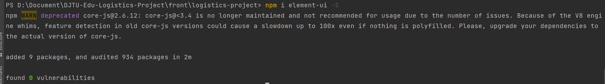

# DJTU 后勤管理系统

> 大连交通大学 信息学院 张箬晗、刘嘉宁
>
> 一个简易的后勤管理系统，学习、练习的项目笔记


## 项目技术栈

- 前端
    - Vue
    - Vue-router
    - Element-ui
    - Vuex
    - axios
- 后端
    - SpringMVC
    - Mybatis
    - Shiro
    - 数据库：MySQL、Redis
    - 版本管理：git
    - 项目管理：Maven


## Vue 环境的配置

- 安装 Vue-cli 环境

    - 链接：[Vue 官网的 Vue Cli 安装教程](https://cli.vuejs.org/zh/guide/installation.html)

    1. 先安装 node.js 环境，在安装时会自动配置 node 和 npm 全局变量
        - 链接：[node.js 官网](https://nodejs.org/en/)

    

    2. 使用 `node -v` `npm -v` 命令查看是否安装成功
    
    
    
    3. 在文件夹下打开 cmd 命令行执行 `vue ui` 命令开始创建 vue 项目


## Vue 项目环境介绍

- 使用 idea 打开刚刚创建的 vue 项目
    - components：组件
    - router：路由
    - store：状态管理
    - views：存放界面


- 在 idea 中添加 npm 的运行配置并设置 Script 为 serve 即可让 idea 一键启动 vue 项目


## element-ui 环境安装

- 在 vue 项目下 执行命令 `npm i element-ui -S` 



- 安装成功后在 package.json 中可以看到相应记录


- 在 main.js 中导入 elememt-ui

```js
import ElementUI from 'element-ui';
import 'element-ui/lib/theme-chalk/index.css';

Vue.use(ElementUI);
```


## axios 环境安装

- 在 vue 项目下 执行命令 `npm install axios -S`


- 安装成功后在 package.json 中可以看到相应记录


- 在 main.js 中导入 axios

```js
import axios from 'axios';

Vue.prototype.$axios = axios
```


12345

qweqw

ning add
